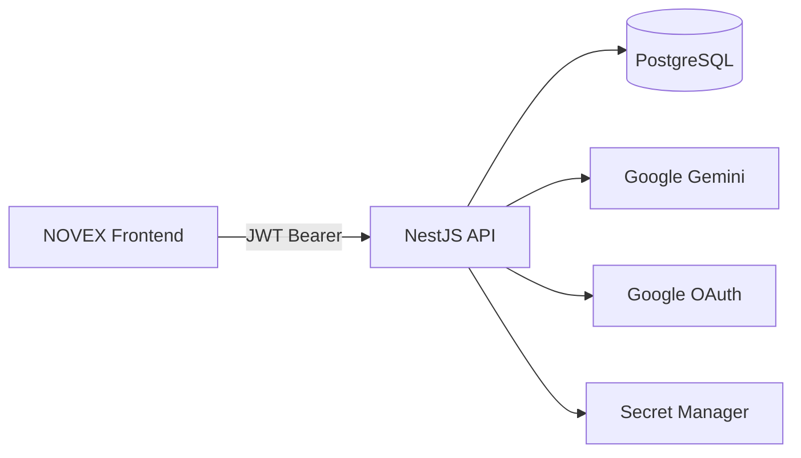
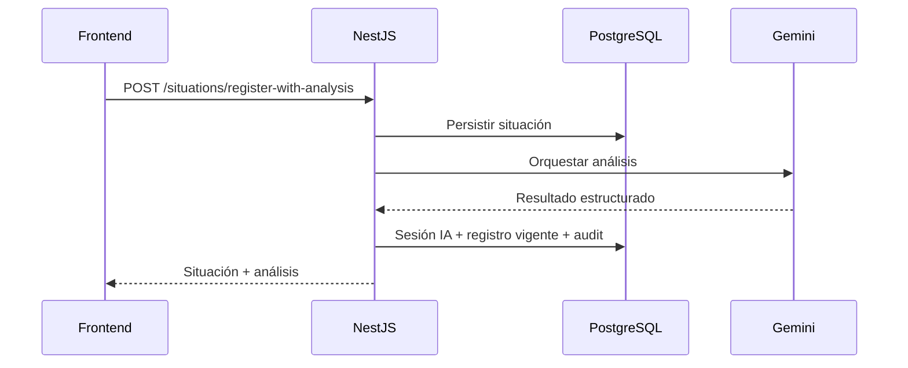
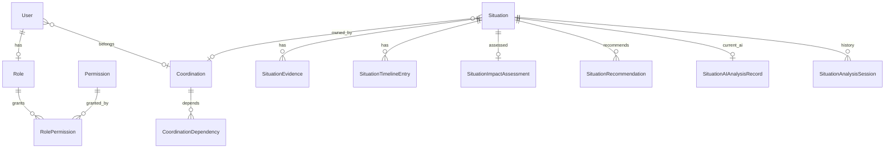

# NOVEX Backend

API oficial de **NOVEX** — plataforma de inteligencia operacional para registrar, analizar y dar seguimiento a situaciones institucionales sobre una red de coordinaciones.

[](https://nodejs.org/)
[](https://nestjs.com/)
[](https://www.typescriptlang.org/)
[](https://www.postgresql.org/)
[](https://typeorm.io/)

Frontend companion: [NOVEX_FRONTEND](https://github.com/DesarrolloFabrica/NOVEX_FRONTEND) · Cloud Run: `novex-backend`

---

## Qué es este servicio

Expone la API REST (`/api/v1`) que consume el frontend NOVEX para:

- autenticación (Google OAuth + JWT);
- usuarios, roles y permisos (RBAC);
- catálogo y grafo de coordinaciones;
- ciclo de vida de situaciones (evidencias, impacto, timeline, recomendaciones);
- orquestación de análisis con **Google Gemini**;
- métricas de dashboard y dominio operacional conservado;
- auditoría append-only de eventos relevantes.

---

## Arquitectura



| Capa | Tecnología |
|---|---|
| Framework | NestJS 11 |
| ORM | TypeORM 0.3 (`synchronize: false`) |
| Base de datos | PostgreSQL 17 (Docker local / Cloud SQL) |
| Auth | Passport JWT + `google-auth-library` |
| IA | `@google/genai`, `@google/generative-ai` |
| Seguridad | Helmet, Throttler, CORS, validación de env |
| Runtime prod | Cloud Run + Artifact Registry |
| CI/CD | GitHub Actions → push a `main` |

---

## Estructura del repositorio

```text
NOVEX_BACKEND/
├── src/
│   ├── configuration/     # Env, CORS, TypeORM, throttle
│   ├── common/            # BaseEntity, enums, logging
│   ├── health/            # Probes /health y /health/ready
│   ├── auth/              # JWT, Google/email, guards, alcance
│   ├── users/ roles/ permissions/ rbac/
│   ├── coordinations/     # Catálogo y grafo institucional
│   ├── situations/        # Ciclo de situaciones
│   ├── situation-*/       # Evidencia, impacto, timeline, recomendaciones
│   ├── ai-orchestration/  # Pipeline de análisis de situaciones
│   ├── ai-analysis*/      # Contratos e historial de sesiones IA
│   ├── intelligence/      # Interpretación Gemini (dominio operacional)
│   ├── operational-*/     # Eventos/áreas operacionales conservados
│   ├── dashboard/         # Métricas
│   ├── audit/             # Audit log append-only
│   └── database/          # data-source, migraciones, seeds
├── test/                  # E2E, security, audit, observability
├── docs/                  # Arquitectura, deploy, secretos, runbook…
├── scripts/               # Cloud SQL, sync users, deploy helpers
├── Dockerfile
├── docker-compose.yml     # Postgres + pgAdmin locales
└── .github/workflows/     # deploy-backend.yml
```

---

## Roles y permisos

| Rol | Responsabilidad | Notas de alcance |
|---|---|---|
| `ADMIN` | Administración de plataforma | Usuarios, roles, permisos, coordinaciones, reportes. **Sin** `SITUATIONS_CREATE/UPDATE/CLOSE` ni `AI_ANALYZE` |
| `DIRECTOR` | Visión ejecutiva | Ver coordinaciones, situaciones y reportes |
| `ANALISTA` | Análisis operacional | Crea/actualiza situaciones **sin** coordinación dueña; puede analizar con IA |
| `COORDINADOR` | Operación de un área | Alcance limitado a su `coordinationId` |

Permisos principales: `USERS_*`, `COORDINATIONS_VIEW/MANAGE`, `SITUATIONS_*`, `AI_ANALYZE`, `AI_VIEW_REPORTS`, `REPORTS_*`, `SYSTEM_CONFIGURATION`.

Autorización: JWT global + enriquecimiento desde BD + `@RequirePermissions` + `OperationalScopeService`.

Fuente: `src/roles/seeds/` y `src/permissions/seeds/`.

---

## Flujos principales

### Autenticación

1. Cliente envía Google ID token → `POST /api/v1/auth/google`.
2. Backend verifica token y exige usuario **pre-registrado** y `ACTIVE`.
3. Emite JWT (`sub`, email, `roleCode`, `coordinationId`, `permissions`).
4. Desarrollo local: `POST /api/v1/auth/email` si `ENABLE_EMAIL_LOGIN=true`.

### Situación + análisis IA



La autorización y las reglas de negocio las decide el backend; Gemini aporta interpretación estructurada.

---

## Ejecución local

### Prerrequisitos

- Node.js **20+**
- npm
- Docker (recomendado para Postgres)
- Google OAuth Client ID
- `GEMINI_API_KEY` para endpoints de análisis

### Instalación

```bash
git clone https://github.com/DesarrolloFabrica/NOVEX_BACKEND.git
cd NOVEX_BACKEND
cp .env.example .env
npm install
npm run docker:up
npm run migration:run
npm run start:dev
```

API local: `http://localhost:3001/api/v1`

### Base de datos local vs Cloud

| `DB_CLOUD` | Destino |
|---|---|
| `false` | Postgres Docker (`novex-postgres`) |
| `true` | Cloud SQL (SSL; IP autorizada) |

Reiniciar el backend tras cambiar `DB_CLOUD`.  
**No ejecutar seeds mock ni operaciones destructivas contra Cloud.**

---

## Variables de entorno

> Nunca deben almacenarse secretos, credenciales o tokens reales dentro del repositorio.

Plantilla: [`.env.example`](.env.example) · Cloud: [docs/SECRETS-AND-VARS.md](docs/SECRETS-AND-VARS.md)

| Variable | Requerida | Descripción |
|---|---|---|
| `NODE_ENV` | Sí | `development` / `production` |
| `PORT` | Sí | Puerto HTTP (local típico `3001`) |
| `API_PREFIX` | Sí | Prefijo de rutas (`api/v1`) |
| `CORS_ORIGINS` | Prod | Orígenes permitidos (coma-separados) |
| `DB_CLOUD` | Sí | `false` local / `true` Cloud SQL |
| `DB_*_LOCAL` / `DB_*_CLOUD` | Según modo | Credenciales de conexión |
| `DB_SYNCHRONIZE` | Sí | Debe permanecer `false` |
| `JWT_SECRET` | Sí | Secreto de firma JWT |
| `JWT_EXPIRES_IN` | Sí | Expiración (ej. `1h`) |
| `GOOGLE_CLIENT_ID` | Sí | Client ID OAuth |
| `ENABLE_EMAIL_LOGIN` | Local | Habilita login por correo |
| `GEMINI_API_KEY` | Para IA | Clave Google AI Studio |
| `GEMINI_MODEL` | No | Modelo Gemini |
| `GEMINI_TIMEOUT_MS` | No | Timeout de operaciones IA |

```env
JWT_SECRET=your-secret
DB_PASSWORD_LOCAL=your-local-password
DB_PASSWORD_CLOUD=your-cloud-password
GOOGLE_CLIENT_ID=your-google-client-id.apps.googleusercontent.com
GEMINI_API_KEY=your-api-key
```

---

## Base de datos

- Esquema administrado **solo con migraciones** TypeORM.
- Tabla de control: `typeorm_migrations`.

```bash
npm run migration:show
npm run migration:run
npm run migration:revert
npm run migration:generate
npm run migration:create
```

### Modelo conceptual



Estados de situación: `OPEN` · `IN_PROGRESS` · `RESOLVED` · `CLOSED`  
Severidad: `LOW` · `MEDIUM` · `HIGH` · `CRITICAL`

---

## API

Prefijo: **`/api/v1`**. No hay Swagger; el contrato vive en los controllers NestJS.

| Dominio | Rutas (resumen) |
|---|---|
| Auth | `POST /auth/google`, `POST /auth/email`, `GET /auth/me` |
| Users | `GET/POST /users`, `GET/PATCH /users/:id`, onboarding |
| Roles / Permissions | `GET /roles`, `GET /permissions` |
| Coordinations | `GET /coordinations`, `/graph`, `/network-status` |
| Situations | listado, detalle, patch, categories, `register-with-analysis`, analyze, analysis/history |
| Evidencias / Impacto / Timeline / Recs | bajo `/situations/:id/...` |
| Dashboard | `GET /dashboard/metrics` |
| Operational | `/operational-events`, `/operational-areas`, `/intelligence`, `/recommended-actions` |

### Health

| Endpoint | Uso |
|---|---|
| `GET /health` | Liveness |
| `GET /health/ready` | Readiness (Nest + `SELECT 1`) |
| `GET /api/v1/auth/health` | Compatibilidad / uptime |

### Principio de aislamiento (dominio operacional)

`OperationalEvents` **nunca** conoce Gemini directamente:

```text
Cliente / IntelligenceService
  → IntelligenceFacade
    → GeminiService
      → GeminiResponseParser
        → GeminiInterpretationResult
```

---

## Autenticación y seguridad

- Google ID Token verificado en servidor; sin auto-alta de usuarios.
- JWT Bearer en requests autenticados.
- Guards globales: JWT, enriquecimiento de autorización, throttling.
- RBAC por permisos + alcance por coordinación (`COORDINADOR`).
- CORS con credentials; en producción `CORS_ORIGINS` es obligatorio.
- Helmet habilitado.
- Secretos vía entorno / Secret Manager — **nunca versionar `.env`**.

> Nunca deben almacenarse secretos, credenciales o tokens reales dentro del repositorio.

Detalle: [docs/SECURITY.md](docs/SECURITY.md)

---

## Inteligencia artificial

| Aspecto | Pipeline de situaciones | Dominio operacional |
|---|---|---|
| SDK | `@google/genai` | `@google/generative-ai` |
| Módulos | `ai-orchestration`, `ai-prompt-engine`, sesiones | `intelligence` |
| Persistencia | `situation_analysis_sessions` + `situation_ai_analysis_records` | `AIInterpretation` (según endpoint) |
| Acceso | `AI_ANALYZE` / `AI_VIEW_REPORTS` | JWT |

---

## Auditoría

Acciones registradas (append-only):

- `SITUATION_CREATED` · `SITUATION_UPDATED` · `SITUATION_STATUS_CHANGED`
- `AI_ANALYSIS_COMPLETED` · `AI_REANALYZED` · `AI_ANALYSIS_FAILED`
- `USER_CREATED` · `USER_ROLE_CHANGED` · `USER_ACTIVATED` · `USER_DEACTIVATED`

No existe API HTTP pública de consulta de audit logs.

---

## Scripts útiles

```bash
npm run start:dev          # Desarrollo con watch
npm run start:prod         # node dist/main.js
npm run build
npm run lint
npm run test               # Jest
npm run test:e2e
npm run test:security
npm run docker:up          # Postgres + pgAdmin
npm run docker:down
npm run seed:rbac          # Solo entornos controlados
npm run cloud:proxy        # Proxy Cloud SQL (PowerShell)
```

---

## Build y despliegue

```text
Push a main / workflow_dispatch
        ↓
GitHub Actions (lint · test · build)
        ↓
Docker → Artifact Registry (novex/)
        ↓
Cloud Run (candidato → smoke → promote)
        ↓
Cloud SQL
```

| Ítem | Valor |
|---|---|
| Proyecto GCP | `it-fab-contenido-edu-5` |
| Región | `us-central1` |
| Servicio | `novex-backend` |
| Trigger | Push a **`main`** o `workflow_dispatch` |
| URL prod | https://novex-backend-smazwcaz4a-uc.a.run.app |

Guías: [DEPLOY_BACKEND.md](DEPLOY_BACKEND.md) · [docs/DEPLOY.md](docs/DEPLOY.md)

---

## Testing

```bash
npm run test              # Unitarios / integración Jest
npm run test:e2e          # E2E
npm run test:security     # test/security
npm run lint
npm run build
```

Cobertura de suites en `src/**/*.spec.ts` y `test/` (security, audit, observability).

---

## Troubleshooting

| Problema | Revisar |
|---|---|
| No arranca / puerto | `PORT`, logs de Nest, `BOOT_VERBOSE` |
| Error PostgreSQL | `DB_CLOUD`, credenciales, `docker:ps`, SSL en cloud |
| CORS | `CORS_ORIGINS` vs origen del frontend |
| Login Google | `GOOGLE_CLIENT_ID`; usuario ACTIVE pre-registrado |
| Migraciones | `migration:show` / `migration:run` |
| Análisis IA | `GEMINI_API_KEY`, modelo, timeout, permiso `AI_ANALYZE` |

Runbook: [docs/RUNBOOK.md](docs/RUNBOOK.md)

---

## Documentación relacionada

| Documento | Contenido |
|---|---|
| [docs/ARCHITECTURE.md](docs/ARCHITECTURE.md) | Arquitectura de producción |
| [docs/DEPLOY.md](docs/DEPLOY.md) | CI/CD y rollback |
| [docs/SECRETS-AND-VARS.md](docs/SECRETS-AND-VARS.md) | Secretos y variables |
| [docs/SECURITY.md](docs/SECURITY.md) | Postura de seguridad |
| [docs/MONITORING.md](docs/MONITORING.md) | Logging y alertas |
| [docs/BACKUP-DR.md](docs/BACKUP-DR.md) | Backups |
| [docs/RUNBOOK.md](docs/RUNBOOK.md) | Incidentes |
| [docs/ENVIRONMENTS.md](docs/ENVIRONMENTS.md) | Diseño de entornos |
| [docs/CUSTOM-DOMAIN.md](docs/CUSTOM-DOMAIN.md) | Dominio personalizado |
| [docs/COSTOS.md](docs/COSTOS.md) | Costos |

---

## Convenciones

- Trabajar en ramas; integrar a `main` con Pull Request (push a `main` despliega).
- Coordinar contratos con [NOVEX_FRONTEND](https://github.com/DesarrolloFabrica/NOVEX_FRONTEND).
- Cambios de esquema → migración TypeORM.
- No versionar `.env`.
- Seeds mock solo en local.

---

## Estado

Proyecto institucional **NOVEX** · API NestJS en Cloud Run · mantenimiento vía PRs sobre este repositorio.
