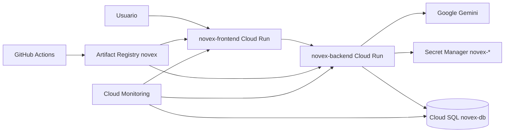

# Arquitectura de producción — NOVEX

## Diagrama

## Componentes

| Componente | Recurso | Notas |
|---|---|---|
| Frontend | Cloud Run `novex-frontend` | nginx, 512Mi, CPU 1, concurrency 80 |
| Backend | Cloud Run `novex-backend` | NestJS, 1Gi, CPU 1, concurrency 40, Cloud SQL |
| Base de datos | Cloud SQL `novex-db` (Postgres 16) | ZONAL, `db-f1-micro`, backups ON |
| Secretos | `novex-db-password`, `novex-jwt-secret`, `novex-gemini-api-key` | Secret Manager |
| Imágenes | `us-central1-docker.pkg.dev/.../novex/` | Tags por SHA7 + digest |
| Auth UI | Google OAuth Client ID | Mismo ID; Origins a actualizar con dominio custom |
| CI/CD | Repos `NOVEX_BACKEND` / `NOVEX_FRONTEND` | Validate → build → deploy → smoke |

## Proyecto GCP

- Project: `it-fab-contenido-edu-5`
- Region: `us-central1`
- Runtime SA (actual): `550902908078-compute@developer.gserviceaccount.com` (default Compute; ver SECURITY.md)

## URLs actuales

- https://novex-frontend-smazwcaz4a-uc.a.run.app
- https://novex-backend-smazwcaz4a-uc.a.run.app
- Health: `/api/v1/auth/health` (backend), `/health` (frontend nginx)
